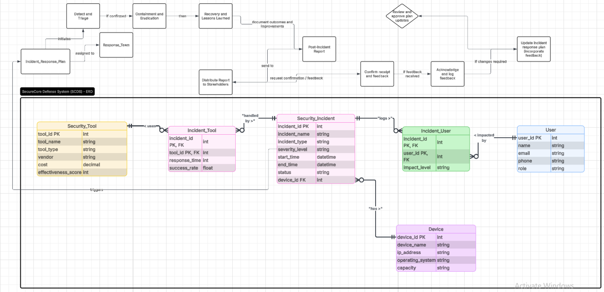

# SecureCore Defense System (SCDS)

## 1. Introduction

SecureCore Defense System (SCDS) is a backend-driven cybersecurity incident management platform designed to model, track, and analyze security events within an organizational infrastructure. The system focuses on structuring relationships between incidents, affected users, associated devices, and applied security tools.

This project demonstrates practical database design, RESTful API architecture, and modular backend development using Node.js and MySQL.



---

## 2. Objectives

The primary goals of this system are:

* To design a normalized relational database for cybersecurity incident tracking
* To model real-world relationships between entities such as users, devices, and tools
* To implement a modular REST API for data access and manipulation
* To simulate an incident response workflow from detection to resolution

---

## 3. System Architecture

The system follows a layered architecture:

* **Presentation Layer**: (optional) client or API consumer
* **Application Layer**: Express.js controllers and routes
* **Data Layer**: MySQL relational database

### Core Modules

* User Management
* Incident Management
* Device Tracking
* Security Tool Analysis

---

## 4. Data Model Overview

The database design is based on an Entity-Relationship model with the following key entities:

* `Security_Incident`
* `User`
* `Device`
* `Security_Tool`

### Relationship Summary

* One device can be associated with multiple incidents (one-to-many)
* One incident can affect multiple users (many-to-many)
* One incident can involve multiple tools (many-to-many)

Junction tables are used to resolve many-to-many relationships:

* `Incident_User`
* `Incident_Tool`

---

## 5. Database Design

The schema is normalized up to Third Normal Form (3NF):

* Each table contains atomic values (1NF)
* Non-key attributes depend fully on the primary key (2NF)
* No transitive dependencies (3NF)

### Example Table: Security_Incident

```sql
CREATE TABLE Security_Incident (
  incident_id INT AUTO_INCREMENT PRIMARY KEY,
  incident_name VARCHAR(255),
  incident_type VARCHAR(100),
  severity_level VARCHAR(50),
  start_time DATETIME,
  end_time DATETIME,
  status VARCHAR(50),
  device_id INT
);
```

---

## 6. Application Structure

```bash
src/
├── config/        # Database configuration
├── models/        # Data access layer
├── controllers/   # Business logic
├── routes/        # API endpoints
├── app.js         # Express app setup
└── server.js      # Entry point
```

The system follows a modular separation of concerns:

* Models handle database queries
* Controllers process requests and responses
* Routes define API endpoints

---

## 7. API Design

The API follows REST principles.

### Incident Endpoints

```
GET    /api/incidents
POST   /api/incidents
GET    /api/incidents/:id
PUT    /api/incidents/:id
DELETE /api/incidents/:id
```

### Relationship Endpoints

```
GET /api/incidents/:id/users
GET /api/incidents/:id/tools
```

---

## 8. Incident Workflow

The system models a simplified incident response lifecycle:

1. Incident detection
2. Association with affected users
3. Identification of impacted device
4. Application of security tools
5. Monitoring and analysis
6. Resolution and closure

This workflow aligns with standard incident response practices in cybersecurity.

---

## 9. Setup Instructions

### 1. Clone repository

```bash
git clone https://github.com/manucian-official/securecore-defense-system.git
cd securecore-defense-system
```

### 2. Install dependencies

```bash
npm install
```

### 3. Configure database

```sql
CREATE DATABASE scds;
```

Import schema:

```bash
mysql -u root -p scds < database/schema.sql
```

### 4. Configure environment variables

Create `.env` file:

```
PORT=3000
DB_HOST=localhost
DB_USER=root
DB_PASS=
DB_NAME=scds
```

### 5. Run the application

```bash
npm run dev
```

---

## 10. Example Request

```json
POST /api/incidents

{
  "incident_name": "DDoS Attack",
  "incident_type": "DDoS",
  "severity_level": "Critical",
  "device_id": 2
}
```

---

## 11. System Evaluation

### Strengths

* Clear separation of concerns
* Scalable relational schema
* Extendable modular architecture

### Limitations

* No authentication or authorization layer
* No real-time monitoring capability
* Limited analytics support

---

## 12. Future Improvements

* Integration of authentication (JWT)
* Real-time event monitoring (WebSocket)
* Analytical dashboard for incident metrics
* AI-based anomaly detection

---

## 13. Conclusion

SecureCore Defense System provides a structured and extensible foundation for managing cybersecurity incidents. The system highlights the importance of proper data modeling, modular backend design, and alignment with real-world workflows.

It can be extended into a full-scale enterprise security platform with additional layers such as authentication, monitoring, and visualization.

---
